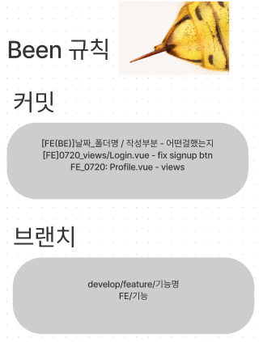
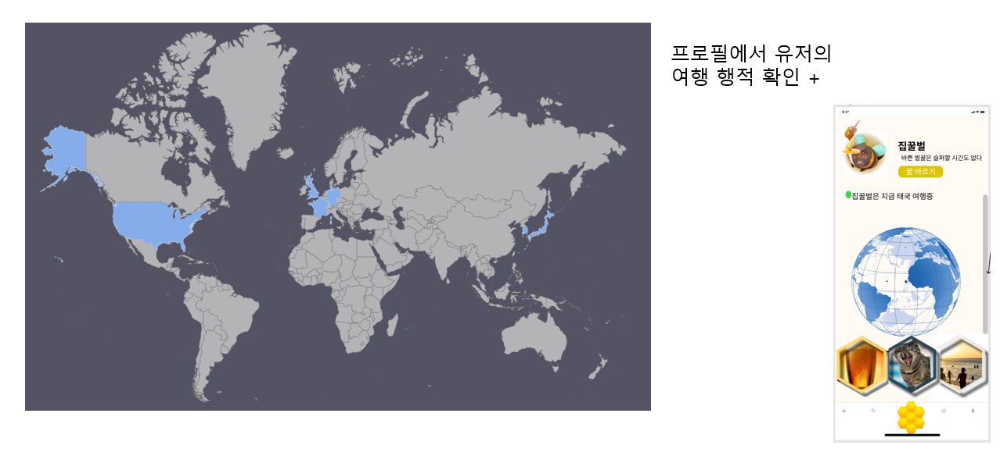
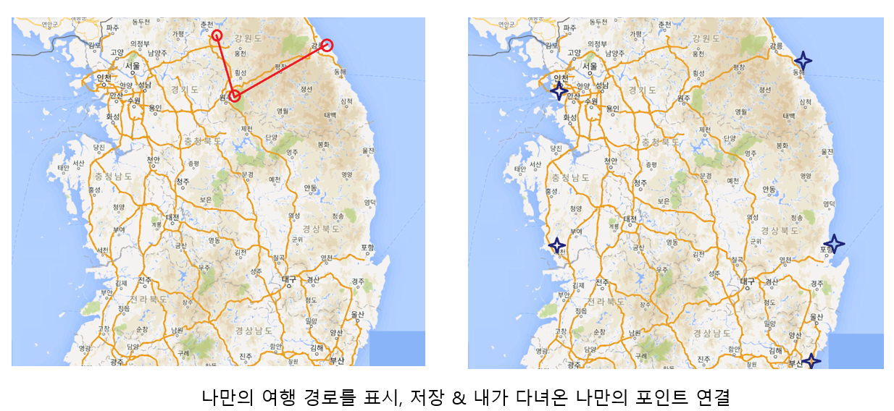

<h2>삼성청년SW아카데미 공통프로젝트</h2>

#### 1. 개요

- #####  Travle Sharing SNS

  - 유저가 업로드한 여행 기록을 RSS 또는 Google Custom Search API를 활용하여 검색 가능하며 

    검색결과를 스크랩하고 유저들과 피드를 통해 공유가 가능합니다.

- ##### Fast Search & Save

  - 키워드와 검색대상을 지정하여 큐레이션 세트를 만들고 이를 통한 빠른 검색이 가능합니다.

    검색 결과를 스킵/스크랩 기능을 통해 원하는 웹 페이지 정보를 쉽게 저장할 수 있습니다.

- ##### Sharing Control

  - 나의 피드는 공개 설정에 따라 팔로워만 볼 수 있도록 변경 가능합니다. 

    비공개일 시에는 승인 절차를 통해 원하는 유저만 팔로워로 승인할 수 있습니다.

- ##### Statistics

  - 이 서비스를 활용하여 나의 키워드의 웹 페이지를 내가 얼마나 많이 읽었는지 지식을 얼마나 쌓았는지 

    통계 페에지를 통해 간접적으로 확인할 수 있습니다.

 

#### 2. 소개

- ##### FrontEnd

  - 고석환
    - frontend 개발
  - 이화정
    - frontend 개발, 컨셉 디자인
  - 최서윤
    - frontend 개발
  - 허진녕
    - frontend 개발, JIRA

- ##### BackEnd

  - 김선우
    - backend 전반
  - 임성환
    - 취업

 

#### 3. 목표

- ##### 사용자 경험 중심의 웹 서비스 구축

- ##### Vue-router에 대한 이해

- ##### Vuex에 대한 이해

- ##### REST API에 대한 이해

- ##### Docker에 대한 이해

- ##### MariaDB에 대한 이해

 

#### 4. 개발환경

- ##### Language

  - Python x.x.x
  - Java x.x.x

- ##### Framework

  - Vue.js x.x.x
  - JavaSpring x.x.x

- ##### Tool

  - Node x.x.x
  - IntelliJ x.x.x
  - Chrome Browser x.x.x

- ##### OS

  - Windows x.x.x

 

#### 5. 규칙

#### 6. ERD

#### 7. storyline

#### 8. WireFrame

#### 9. 추가 예정 기능

