
<h4>여행 경험 공유 SNS</h4>

> 서비스명: 비이이인(BEE~n)
>
> 팀명: BEE(N)   (B301)
>
> 개발 기간:  20210712 ~ 20210820 (6주)

#### 1. 서비스 개요

- #####  Travel Sharing SNS

  - 사용자가 업로드한 여행 기록을 검색 가능하며 

    검색결과를 스크랩하고 다른 사용자들과 피드를 통해 공유가 가능합니다.
    
  - 자신의 여행 족적을 지도에 남길 수 있으며 여행 지역과 선호 여행 방식을 통해 사용자와 어울리는 게시글을 추천합니다.

  - 다양한 형태의 게시글form을 지원해  사용자의 개성과 편의를 지원합니다.

 

#### 2. 팀원 소개

- 팀장

  - 허진녕
    - frontend 
      - 로그인, 회원가입
      - 지도 기능
      - 게시글 상세 페이지
    - 프로젝트 배포
    - JIRA

- 팀원

  - 김선우
    - backend 전체
    - API설계
    - database 구성
  
  - 고석환
    - frontend
      - 프로필 페이지
      - 회원 정보 수정
      - 게시글 작성
    - UCC
  - 이화정
    - frontend
      - 메인 페이지
      - 검색 페이지
      - 큐레이션 페이지
    - 컨셉디자인

 

#### 3. 주요 기능

- ##### 회원가입 / 로그인

  - 사용자의 정보를 받아 메일 인증 후 회원가입을 완료한다.
  - 가입할 때 사용자에게 선호 여행지역, 선호 여행 취향을 하나씩 입력받는다.

- ##### 지도 표시

  - 메인 화면에 사용자의 여행 지역 표시창이 제공된다.
  - 여행 지역 입력 페이지에서 지도의 지역을 선택하면 마커가 새롭게 추가된다. 
  - 마크한 지역들로 큐레이션 페이지에서 추천 게시글을 볼 수 있다.

- ##### SNS 기능

  - 메인페이지에서는 내가 팔로우한 사용자의 최신 피드를 확인하거나 새글 작성을 할 수 있다.
  - 큐레이션 페이지에서 사용자의 선호 지역, 선호 스타일에 따른 추천 피드를 확인할 수 있다.
  - 마이 프로필 페이지에서 해당 사용자의 피드, 전체 프로필, 팔로우리스트 확인, 팔로우 신청을 할 수 있다.
  - 게시글 상세보기 페이지에서  좋아요를 표시할 수 있고, 댓글을 등록할 수 있다. 
  - 게시글 수, 좋아요 수등 활동 이력을 쌓아 tier를 높일 수 있다. 

- ##### 게시글 작성 폼 선택

  - 게시글 작성 시 여행 지역, 스타일, 사진, 글내용과 상세페이지에 표시될 폼을 선택합니다.
  - 선택한 폼에 따라 각기 다른 형태의 상세보기 페이지를 확인할 수 있습니다.

 

#### 4. 목표

- ##### 사용자 경험 중심의 웹 서비스 구축

- ##### Vue-router에 대한 이해

- ##### Vuex에 대한 이해

- ##### REST API에 대한 이해

- ##### Docker에 대한 이해

- ##### MariaDB에 대한 이해

 

#### 5. 기술 스택, 프로젝트 구조

##### 

 

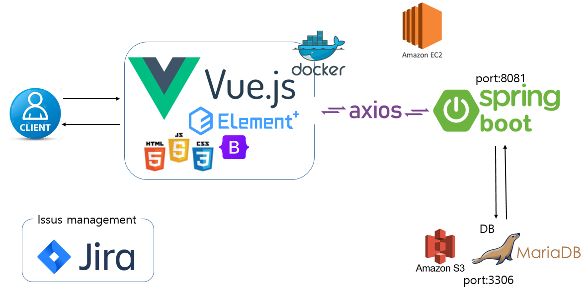

 

#### 6. 규칙

#### commit 

- [FE, BE]날짜_작성한폴더/작성,수정한 부분  간략한수정사항
  - ex) [FE]0819_src/views/Login.vue 회원가입route 수정

#### branch

- develop/Frontend(Backend)/기능명

 

#### 7. 프로젝트 설계

- #### ERD

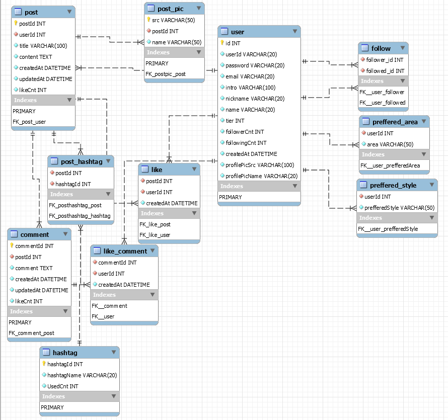

 

- #### storyline

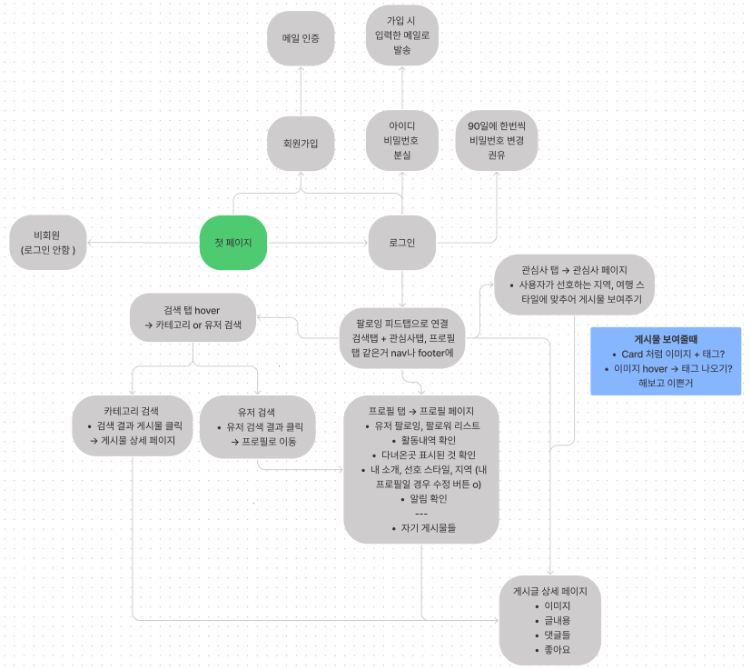

 

- #### WireFrame

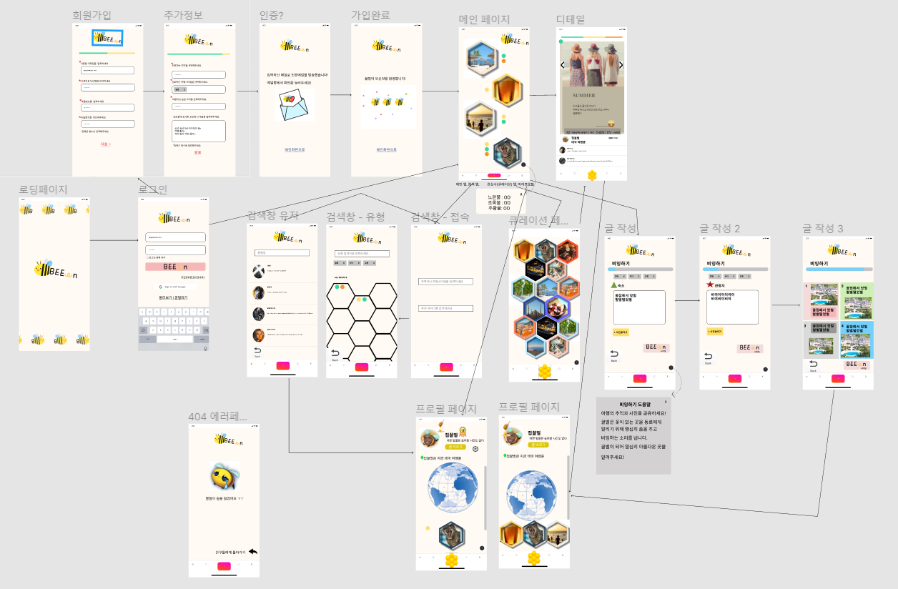

 

#### 8. 주요기능 미리보기

- 회원가입

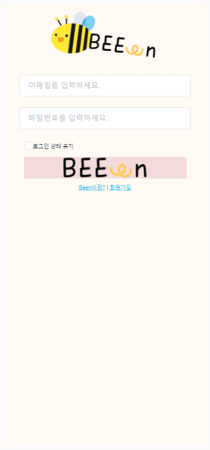

사용자의 정보, 선호지역과 선호 여행 취향을 받고 메일인증 후 회원가입합니다.

 

- 로그인 - 메인페이지

|로그인|메인|
|:-:|:-:|
|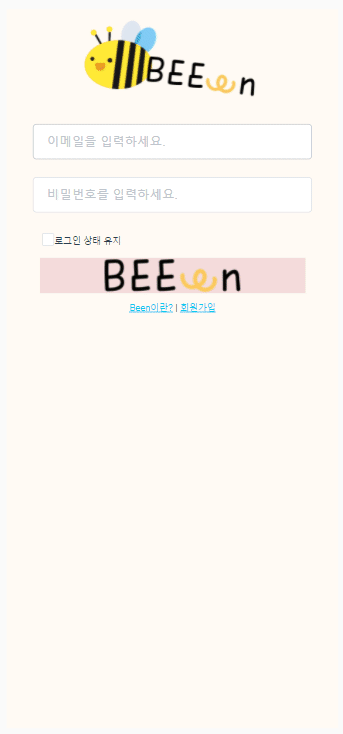|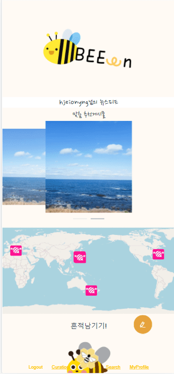|

로그인 후 메인페이지로 이동합니다. 메인페이지에서는 맞춤 추천 게시물, 나의 여행 흔적, 팔로잉한 유저들의 피드를 확인할 수 있습니다.

 

- 새 글 작성 - 게시글상세

|새 글 작성|글 상세보기|
|:-:|:-:|
|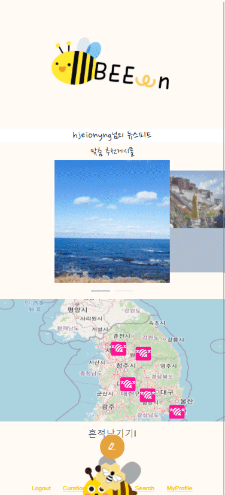|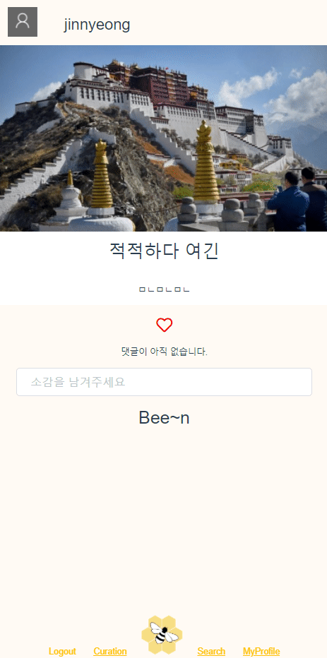|

게시글 작성 시 여행 지역, 스타일, 사진, 글내용과 상세페이지에 표시될 폼을 선택합니다. 선택한 폼에 따라 각기 다른 형태의 상세보기 페이지를 확인할 수 있습니다. 상세보기 페이지에서 댓글, 좋아요 같은 SNS활동을 할 수 있습니다.

 

- 검색

|유저 검색|피드 검색|
|:-:|:-:|
||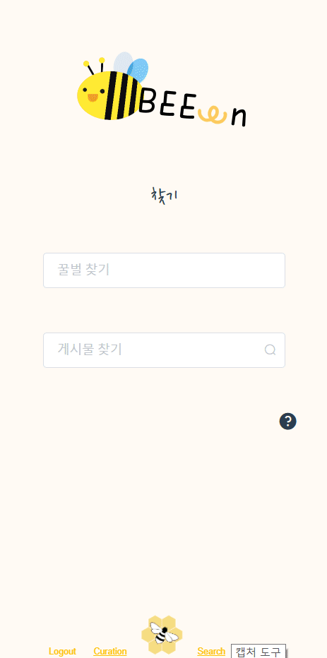|

사용자의 닉네임을 통해 검색하여 해당 사용자의 프로필로 이동할 수 있습니다. 피드 검색을 통해 해당 정보가 있는 피드를 확인할 수 있습니다.

 

- 여행 지역 지도 표시

지도에 내가 여행한 곳, 여행하고싶은 곳을 직접 표시하여 남길 수 있습니다.

 

- 선호 스타일 추가, 추천 피드

|선호 스타일 추가|추천 피드|
|:-:|:-:|
|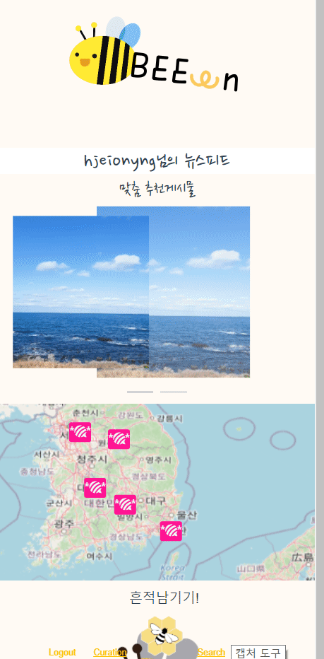|.gif)|

내 흔적 남기기로 선호 여행 지역, 스타일을 추가할 수 있습니다. 사용자의 선호 여행 지역, 선호 스타일에 따라 알맞는 피드를 큐레이션 페이지에서 추천받을 수 있습니다.

